<div align="center">
  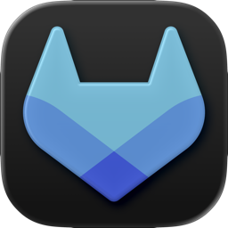
  <h1>Tanuki Bell</h1>
  <p><em>Never miss a merge request again.<br>Native macOS notifications for GitLab — right from your menu bar.</em></p>

  [](https://www.apple.com/macos/)
  [](https://swift.org/)
  [](https://developer.apple.com/xcode/swiftui/)
  [](LICENSE)
</div>

<br>

> [!NOTE]
> A native macOS menu bar app that monitors GitLab for merge request activity and delivers classified, actionable notifications. Replaces the [multi-component script-based system](https://github.com/danielkuhlwein/gitlab-pr-notifier) with a single, polished SwiftUI application — no Mail.app dependency, no LaunchAgents, no Terminal commands.

## Features

- **Menu bar app** — lives in your menu bar with a bell icon, no Dock clutter
- **14 notification types** — each with a distinct coloured icon, from review requests to pipeline failures
- **Native notifications** — per-MR grouping, click-to-open, action buttons (Open in GitLab, Mark as Done)
- **Smart polling** — 30s active, 2min idle, with ETag caching for efficiency
- **Comment excerpts** — see what was said right in the notification
- **Notification preferences** — enable or disable each type individually
- **Notification history** — searchable, filterable log of all past notifications
- **Auto-updates** — via Sparkle with EdDSA signature verification
- **Launch at login** — via SMAppService (no LaunchAgent plist needed)
- **Adaptive polling** — automatically slows down when your machine is idle

## How It Works

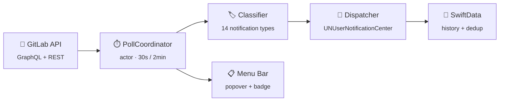

1. **PollCoordinator** fetches pending todos via GitLab's GraphQL API every 30 seconds (ETag-cached)
2. **NotificationClassifier** maps each todo action to one of 14 notification types
3. **NotificationDispatcher** sends native macOS notifications with per-type icons
4. **Supplemental polls** (every 2 min) detect MR state changes and edited comments via REST API
5. **SwiftData** persists processed todo IDs (deduplication), notification history, and tracked MR state
6. Everything auto-cleans after 7 days

## Notification Types

<table>
<tr><th>Type</th><th>Trigger</th></tr>
<tr><td>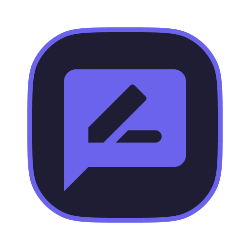 Review Requested</td><td><code>review_requested</code> todo</td></tr>
<tr><td>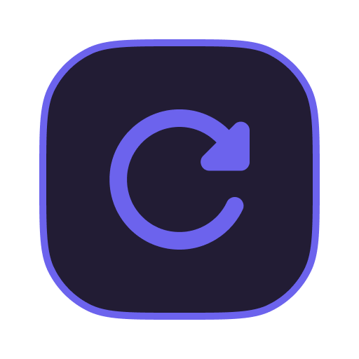 Re-Review Requested</td><td>Reviewer list diff between polls</td></tr>
<tr><td> Assigned to You</td><td><code>assigned</code> todo</td></tr>
<tr><td>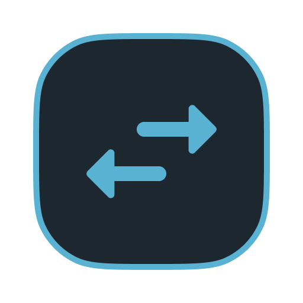 Reassigned</td><td>Assignee list diff between polls</td></tr>
<tr><td>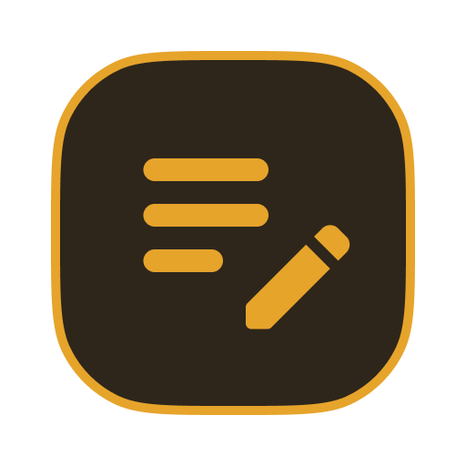 Changes Requested</td><td>Unresolved review threads</td></tr>
<tr><td>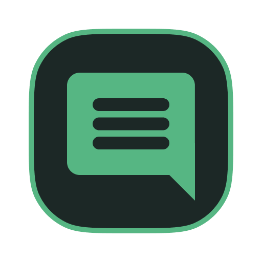 New Comment</td><td><code>mentioned</code> / <code>directly_addressed</code> todo</td></tr>
<tr><td>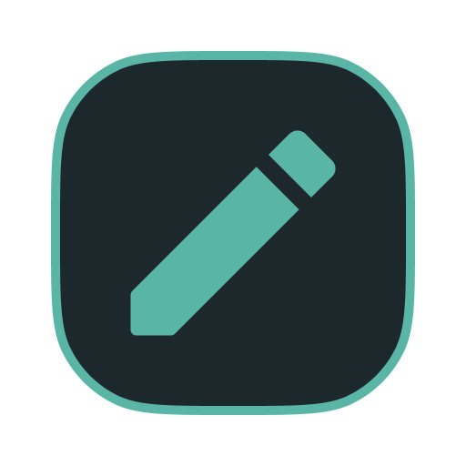 Comment Edited</td><td>Notes API (<code>updated_at > created_at</code>)</td></tr>
<tr><td>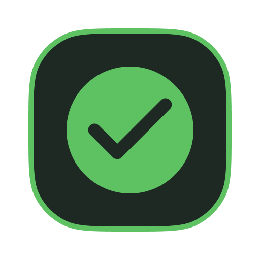 Approved</td><td><code>approval_required</code> / <code>review_submitted</code> todo</td></tr>
<tr><td>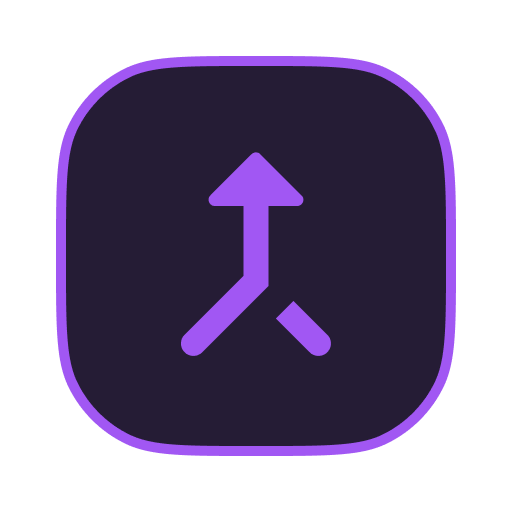 Merged</td><td>MR state poll</td></tr>
<tr><td>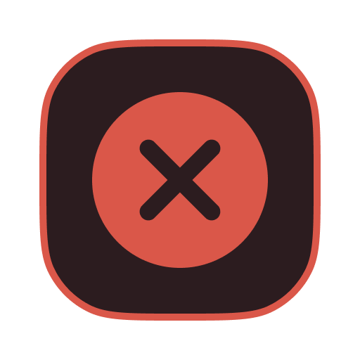 Closed</td><td>MR state poll</td></tr>
<tr><td> Mentioned</td><td><code>mentioned</code> todo</td></tr>
<tr><td> Pipeline Failed</td><td><code>build_failed</code> todo</td></tr>
<tr><td>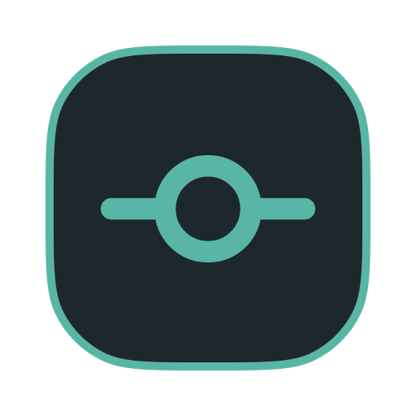 New Commits Pushed</td><td>Commit diff between polls</td></tr>
<tr><td>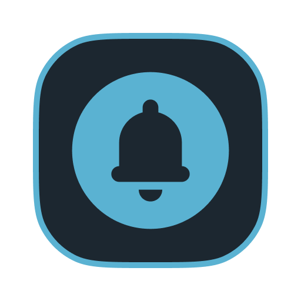 MR Activity</td><td>Catch-all for other actions</td></tr>
</table>

## Getting Started

### Download

1. Grab the latest `.dmg` from [**Releases**](https://github.com/danielkuhlwein/tanuki-bell/releases)
2. Open the DMG and drag **Tanuki Bell** to Applications
3. On first launch, macOS will block the app since it's not notarised:
   - Double-click the app — you'll see a blocked dialogue — click **Done**
   - Open **System Settings → Privacy & Security**
   - Scroll down and click **Open Anyway**
   - This is a **one-time** step

### Build from Source

```bash
# Clone
git clone https://github.com/danielkuhlwein/tanuki-bell.git
cd tanuki-bell

# Generate Xcode project (requires xcodegen)
brew install xcodegen  # if needed
xcodegen generate

# Build
xcodebuild -project TanukiBell.xcodeproj -scheme TanukiBell -configuration Release build
```

### Setup

1. Launch Tanuki Bell — a 🔔 icon appears in your menu bar
2. Click the bell → **Settings...**
3. In the **Connection** tab:
   - Set your GitLab URL (default: `https://gitlab.com`)
   - Create a **legacy** Personal Access Token in GitLab (Profile → Access Tokens) with the **`read_api`** scope
   - Paste the token and click **Test Connection**
   - Click **Save & Start Polling**
4. Enable notifications when prompted (or in System Settings → Notifications → Tanuki Bell)

## Configuration

Open **Settings** from the menu bar popover to configure:

| Tab | Options |
|-----|---------|
| **Connection** | GitLab instance URL, Personal Access Token, test connection |
| **Notifications** | Toggle each of the 14 notification types, sound on/off |
| **General** | Poll interval (15s–300s), launch at login |
| **History** | Searchable, filterable log of all past notifications |

## Releasing

```bash
# Build + create DMG
./scripts/build-release.sh 1.0.0

# Build + create DMG + publish to GitHub Releases
./scripts/build-release.sh 1.0.0 --publish

# Generate Sparkle EdDSA keys (one-time)
./scripts/generate-sparkle-keys.sh
```

<details>
<summary><strong>Project Structure</strong></summary>

<br>

```
TanukiBell/
├── TanukiBellApp.swift               # @main, MenuBarExtra scene
├── AppDelegate.swift                 # Notification delegate, permission prompt
├── AppState.swift                    # @Observable, polling lifecycle
├── Services/
│   ├── GitLabService.swift           # GraphQL + REST client, ETag caching
│   ├── PollCoordinator.swift         # Actor, primary + supplemental timers
│   ├── NotificationClassifier.swift  # Todo → NotificationType mapping
│   ├── NotificationDispatcher.swift  # UNUserNotificationCenter wrapper
│   ├── NotificationPreferences.swift # Per-type enable/disable (UserDefaults)
│   ├── KeychainStore.swift           # Security framework PAT storage
│   ├── IdleMonitor.swift             # CGEventSource activity monitor
│   └── UpdaterController.swift       # Sparkle wrapper
├── Models/
│   ├── GitLabAPITypes.swift          # Codable types for GraphQL + REST
│   ├── NotificationType.swift        # 14 types with metadata + icons
│   ├── ProcessedTodo.swift           # SwiftData — deduplication
│   ├── NotificationRecord.swift      # SwiftData — history
│   ├── PollState.swift               # SwiftData — poll timestamps
│   └── TrackedMergeRequest.swift     # SwiftData — MR state tracking
├── Views/
│   ├── MenuBarPopover.swift          # Main popover with notification list
│   ├── NotificationRowView.swift     # Single notification row
│   ├── SettingsView.swift            # Tabbed settings window
│   ├── ConnectionSettingsTab.swift
│   ├── NotificationSettingsTab.swift
│   ├── GeneralSettingsTab.swift
│   └── NotificationHistoryView.swift
└── Resources/
    ├── Assets.xcassets               # App icon + 13 notification type icons
    └── GraphQL/Queries.swift         # GraphQL query constants
```

</details>

## Known Issues

| Issue | Detail |
|-------|--------|
| [New Commits Pushed shows MR author, not actual pusher](https://github.com/danielkuhlwein/tanuki-bell/issues/1) | The GitLab REST MR detail endpoint doesn't expose who last pushed. A separate commit API call per detected SHA change would be needed to surface the real pusher. |
| [HTML numeric entities appear raw in notification bodies](https://github.com/danielkuhlwein/tanuki-bell/issues/2) | Comment excerpts containing curly quotes (`&#8220;`), em-dashes (`&#8212;`), etc. render as literal entity strings rather than the actual characters. |

## Licence

MIT — do whatever you want with it.
